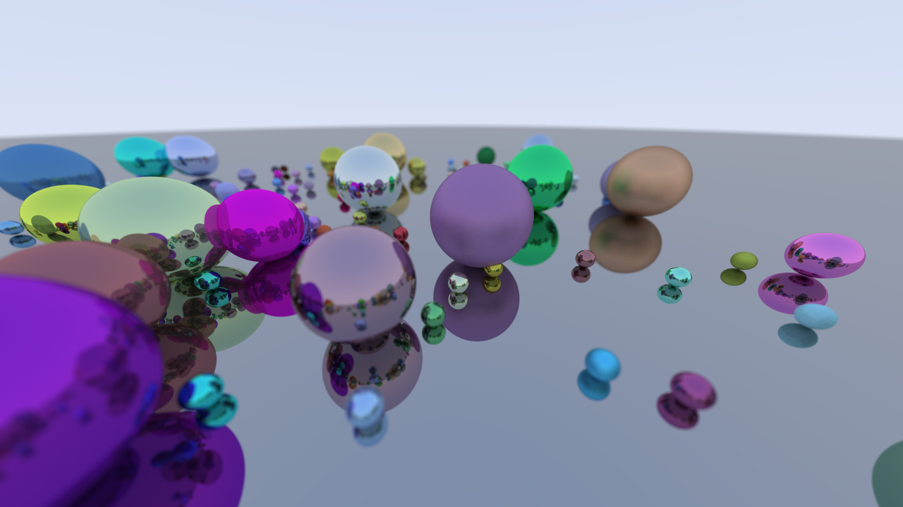

# Raytracer

A very simplistic raytracer with some rudimentary physics - implemented in Rust - based on [a nice tutorial by Peter Shirley](https://raytracing.github.io/books/RayTracingInOneWeekend.html).

Features:
- Spheres as the only type of object
- Lambertian surfaces
- Reflections
- Depth of field
- Some hardcoded initial conditions and camera movements
- Display and export as images and video

Things it does not have:
- Refraction
- Fog
- Textures
- Any interesting objects
- Optimizations like bounding volume hierarchies
- All the countless other cool things good raytracers can do



# Compile and run

```bash
RUSTFLAGS="-C target-cpu=native" cargo run --release --package raytracer --bin main
```

When done, you'll find an `output` directory with a bunch of image (`.png`) files and (if `ffmpeg` is available) a video (`.mp4`) in it.

# Render quality

The settings can be changed in `raytracer.toml`.

# todo

- Light sources
- Motion blur
- Let spheres light up (and get non-reflective) when bouncing according to magnitude of change of speed
